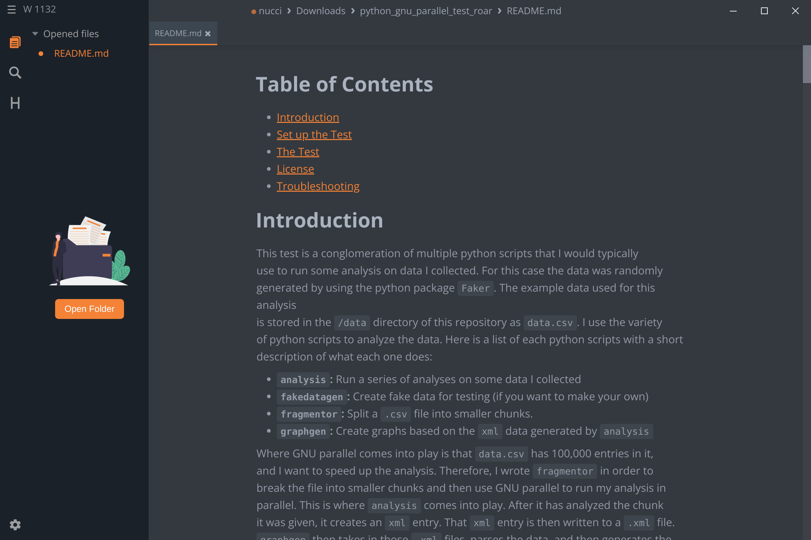

<h1 align="center">
  
   
   
  MarkText
</h1>

<b>This is the snap for MarkText</b>, <i>“A simple and elegant markdown editor”</i>. It works on Ubuntu, Fedora, Debian, and other major Linux
distributions.

Published for  with 💝 by Snapcrafters

## Install

    sudo snap install marktext

([Don't have snapd installed?](https://snapcraft.io/docs/core/install))

> The upstream marktext repository/alternative downloads can be located [here](https://github.com/marktext/marktext).

## The Snapcrafters

|  |
| :---: |
| [Jason C. Nucciarone](https://github.com/NucciTheBoss/) |
